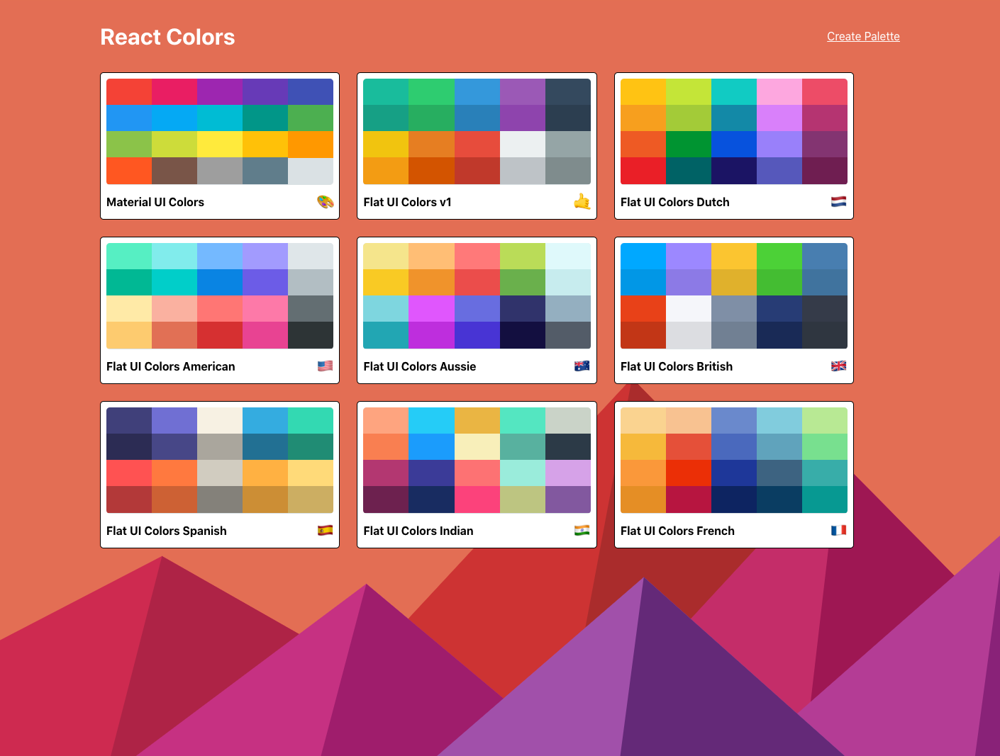
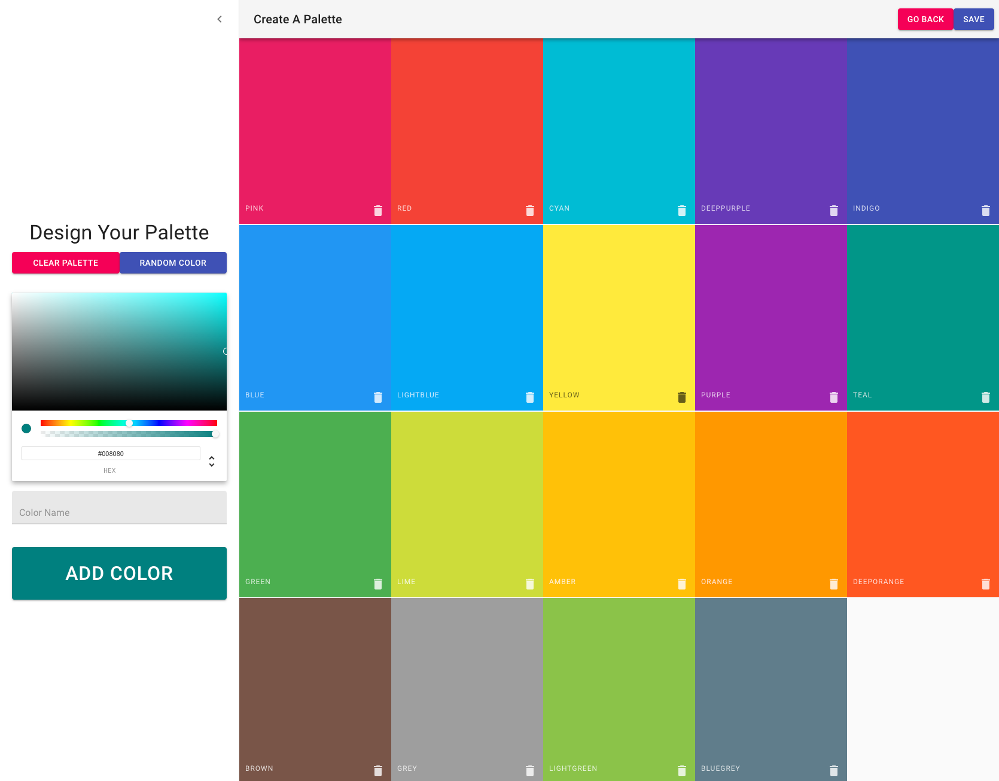

# React - Color Picker App

- React color picker based on [Flat UI Colors](https://flatuicolors.com/) and [Material UI Colors](http://materialuicolors.co/?utm_source=launchers)
- Part of the final project from Colt Steeles React Bootcamp

  

  

### Tools used in this project

[JSS](https://cssinjs.org/) - Used to get colors 
[Chroma.js](https://gka.github.io/chroma.js/) - Used to get colors 
[Materual UI](https://material-ui.com/) - A popular React UI framework 
[React Sortable Hoc](https://github.com/clauderic/react-sortable-hoc) - Used for drag and drop 
[React Copy To Clipboard](https://www.npmjs.com/package/react-copy-to-clipboard) - Click copy to clipboard  
[Emoji-Mart](https://github.com/missive/emoji-mart) - Emojis  
